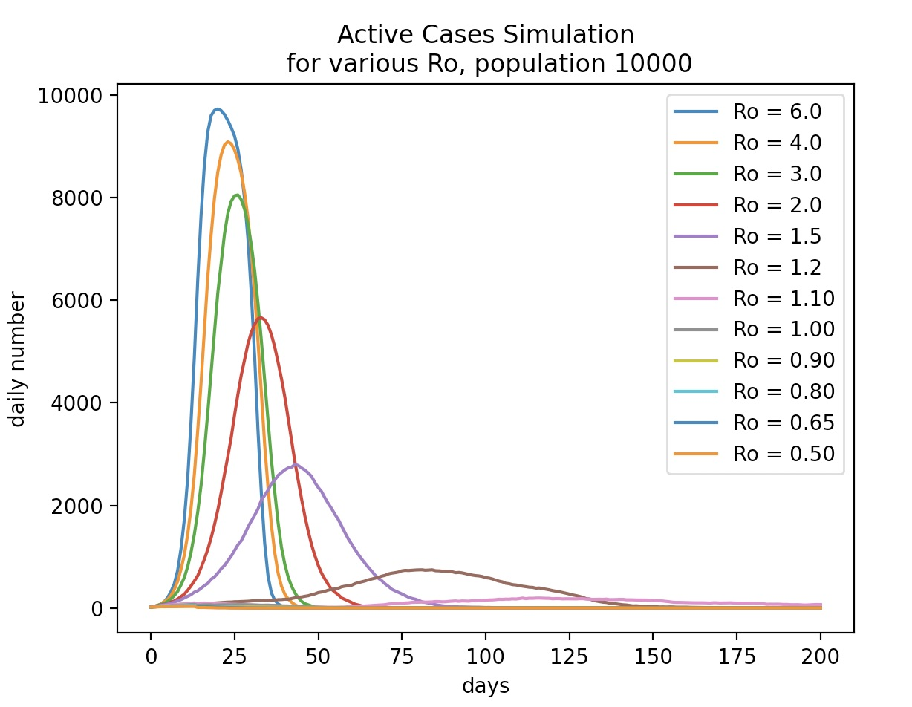
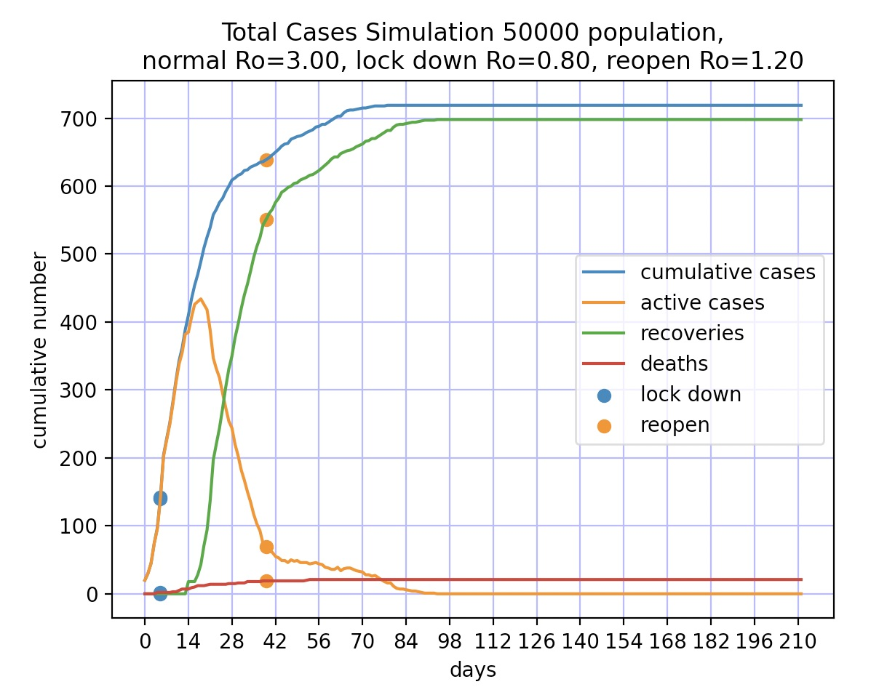
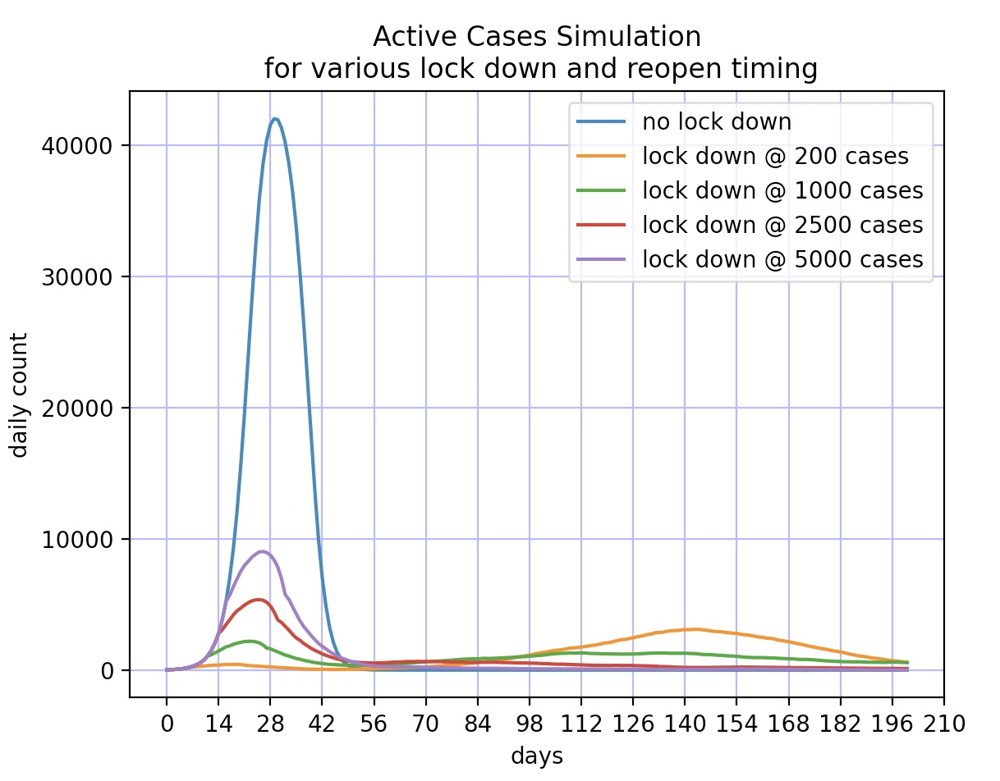

# corona-sim

Roy Hall <[royster.hall@gmail.com](royster.hall@gmail.com)

A coronavirus simulation we are using as a programming project while HRVHS is closed to coronavirus. The main point
is to help our FRC learn to python before we dive into python for FRC.

The learning had two phases that can be done together:
* [30 days of Python](https://blog.tecladocode.com/tag/30-days-of-python/) - a blog series for learning the
  python language; coupled with [Python in 30 Days - Support 
  Notes](https://docs.google.com/document/d/1wFdRYH_ESaQ4gfFgarrGcpRMRRBlF52NgxPpZ2ftzOA/edit#heading=h.d1vcsdpzhpfs)
  on the HRVHS Google Drive discusses the blogs in terms of using PyCharm and git so students can learn about
  using an IDE and git/github while following the blogs.
* Building a coronavirus simulation using the programming concepts from the *30 days of Python* and fully
  described in [Coronavirus Modeling and
  Simulation](https://docs.google.com/document/d/1ZaHgsrZf2CAnYB3ZatCPFzu_1CEDIAbBG3G7OPw_680/edit#heading=h.2tkptf89gawx)

## Exercise 1  
Build a simple time stepped agent-based simulation to simulate how an infection spreads through a population. A
solution is in `exercise_1.py` file.

## Exploration 1
Using the `exercise_1.py` program to explore the metric <i>R0</i> in the spread of an infectious
disease. Data generated from this exploration is in `./data/expl1/*`, and the program `exploration1.py`
graphs that data. An example of the simulations for various <i>R0</i> in a population of 10,00 is:

## Exercise 2
Starts with a copy of `exerecise_1.py` as `exercise_2.py`. In this copy we: makes a few modeling corrections;
add data output to a file; and add capability to specify a sequence of phases in the simulation which
are activated by meeting specified conditions - like the number cases has reached a threshold, or some
number of days since the start of the simulation, or number of days since peak new cases. Each phase
defines the parameters that produce the <i>R0</i> for that phase.

## Exploration 2:
Using some assumptions about measures like travel bans, stay and home, and physical distancing use the
simulation to investigate the differences between early and late mitigation to see how that affects the
course of a disease. Let's also look at different effectiveness  of, that is, different values for the Ro
during, the stay at home as it affects the dynamics of reopening. Data generated from this exploration is
in `./data/expl2/*`, and the program `exploration2.py` graphs that data. `exploration2_old.py` was the
original high copy and paste version, and `exploration2.py` the refactored version to help us move
forward with less work and more consistency.

## Exercise 3:
A refactoring of exercise 2 code to make it easier to test different scenarios and build run sets for
different scenarios. As we do this we will look at the split between the number of confirmed cases and
the estimated number of cases. We will also add a projected hospitalized and critically ill, and a way
to add events like a convention, weekend party, concert, etc. We had a lot of ambitions here, but are
getting to the end of the school year, and have a new swerve drive base to program. So this is a bit
condensed and broken into a number of steps:
* `exercise_3a.py` - pull the simulation state into a separate `simulate.py` file , with all of the
  keys defined as constants;
* `exercise_3b.py` - pull the phase evaluation into functions so a `phases.py` file that specifically
  deals with phases can be pulled out;
* `exercise_3c.py` - we know testing is only detecting a fraction of the cases. Add testing probability
  to the simulation;
  
## Exploration 3:
Explore what happens when you have a concert.

